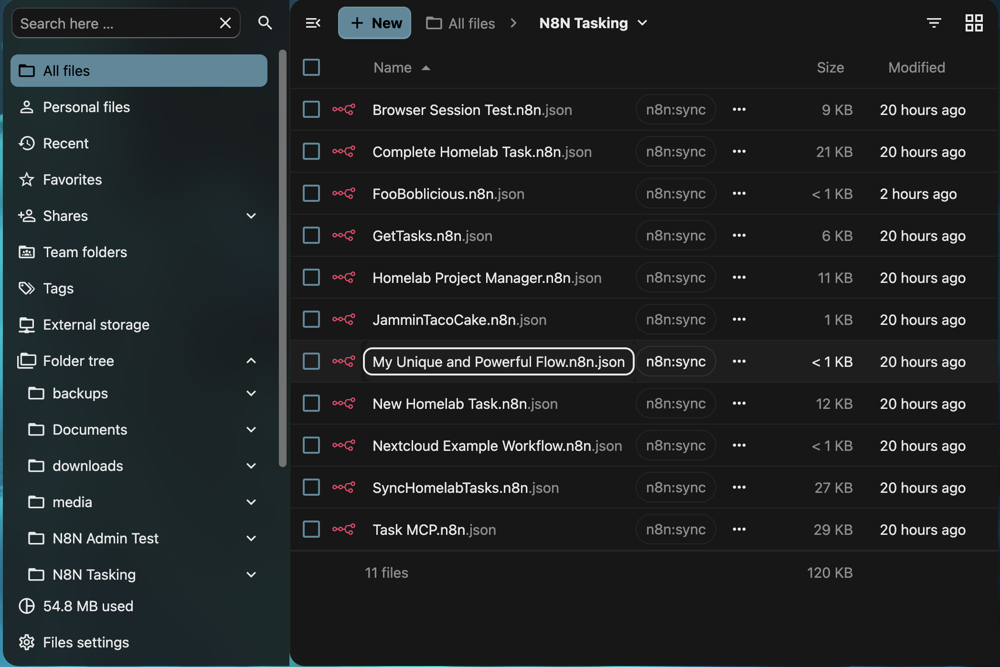
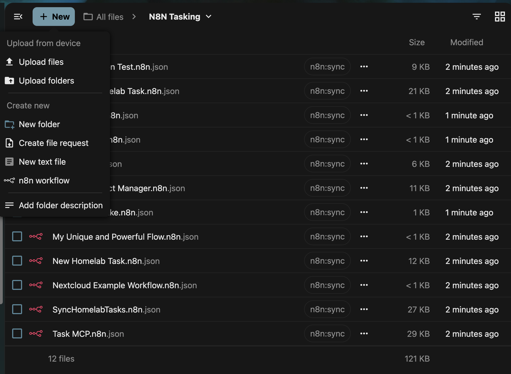
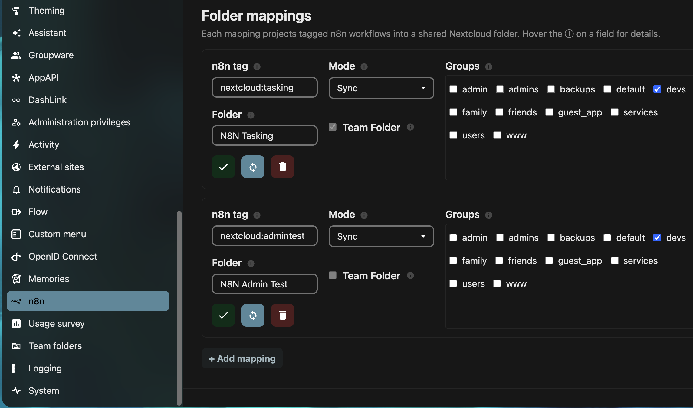

# n8n Sync

A Nextcloud app that surfaces n8n workflows as native files — browse, edit, and manage your automation workflows right inside the Files app, with full bidirectional sync back to n8n.

[](https://github.com/kubed-io/nextcloud-n8n/actions/workflows/tests.yml)
[](https://github.com/kubed-io/nextcloud-n8n/actions/workflows/quality.yml)
[](https://github.com/kubed-io/nextcloud-n8n/actions/workflows/integration.yml)
[](LICENSE)
[](https://apps.nextcloud.com)
[](composer.json)



*Your n8n workflows, living in Nextcloud as native `.n8n.json` files — tagged, versioned, and synced both ways.*

---

## How It Works

n8n Sync maps one or more n8n workflow tags to Nextcloud folders. Every workflow carrying a mapped tag appears in the corresponding folder as a `.n8n.json` file. Depending on the mode you choose, changes you make in Nextcloud push back to n8n automatically, and changes made in n8n pull back into Nextcloud on a schedule.

```
n8n (tagged workflows) ⟺ Nextcloud (mapped folder)
```

The sync is reconcile-based: re-running a pull never duplicates files. The link between a file and its workflow is a stable workflow ID embedded in the file's metadata — not the filename — so renaming, moving, and restoring all work without ever breaking the connection.

---

## Modes

Every managed `.n8n.json` file is in exactly one of four modes. The mode is the single source of truth for how much authority Nextcloud has over the workflow — there is no separate "writeback" setting to reason about.

| Mode | File content | In a mapping? | Pushes to n8n? |
|---|---|---|---|
| **Sync** | Full workflow JSON | yes | Yes — bidirectional |
| **Link** | Tiny pointer (id, name, URL) | yes | No — click opens n8n |
| **Unmapped** | Full JSON, moved *out* of a mapping (archived in n8n, restorable) | no | No |
| **Ignored** | Full JSON, left *in* a mapped folder but deliberately skipped | yes | No |

### Sync

Full two-way ownership. The workflow JSON lives in Nextcloud and any save — via the web editor, WebDAV, or your desktop client — pushes the updated workflow back to n8n. Renaming the file renames the workflow in n8n, and vice versa. Because Nextcloud always holds the complete JSON, a sync folder is also a full, restorable backup of every workflow in it.

### Link

A lightweight pointer. The file holds only the workflow's ID, name, and URL — not the full JSON. Clicking it opens the workflow in n8n (links are read-only by nature: you edit in n8n, not in the file). Deleting a link just untags the workflow in n8n; the workflow itself is untouched. Use a link to give a folder a "shortcut" to a workflow that lives elsewhere.

### Unmapped

When you **move** a sync workflow *out* of its mapped folder, it becomes **unmapped**: Nextcloud keeps the full JSON (and the workflow's identity), while the workflow is archived in n8n. The file is now a free-standing, self-contained copy you can keep anywhere. Move it back into any mapping and the workflow is **restored** in n8n — same workflow, not a new one. An unmapped file is, in effect, a portable archive of a workflow.

### Ignored

Sometimes you want to keep a workflow file **in** its mapped folder but stop syncing it. Tag it `n8n:ignore` and it becomes **ignored**: it stays put and keeps its identity, the workflow is archived in n8n, and every sync (scheduled or manual) skips it. It's the in-place sibling of *unmapped* — same "parked, archived, restorable" idea, but the file never leaves the folder. Remove the `n8n:ignore` tag and it returns to the mapping's default mode.

## Tags — one searchable set

A workflow's **tags** are part of the object, so a full sync keeps them in step too. n8n holds tags on the workflow; Nextcloud has its own first-class **system tags** (the searchable coloured pills in Files). n8n Sync keeps the two the same set, so **the mirror is as searchable as n8n itself** — filter "every `prod` workflow" the Nextcloud-native way.

Because the tags are part of the object, there are several places to edit them, kept in agreement:

- **Edit in n8n** → a pull brings the tags into the Nextcloud file's pills.
- **Edit the file's pills** → the change pushes back to n8n on the next sync.

Removing a tag on either side removes it on the other: drop a pill and the next push drops the n8n tag; drop it in n8n and the next pull drops the pill. (Editing the `tags` array *inside* the `.n8n.json` body is a **planned** third surface — today the body's tag array is written by a pull but a hand-edit to it is not yet projected onto the pills or pushed; use the pills for now.)

Two rules keep it safe. The app's own control tags (the reserved `n8n:` namespace, e.g. `n8n:sync`, `n8n:ignore`) are **never** mixed into your workflow's tags in either direction. And because the app remembers the last-synced set (a baseline), a change on one side is applied to the other as a true *add* or *remove* rather than a blind overwrite. Tag sync runs in **both** `sync` and `link` mappings for searchability — a `link` file never pushes, so its tags flow one way, n8n → Nextcloud.

> **One n8n-specific caveat — the mapping tag is protected.** Because a folder mapping is keyed **by tag**, the tag that binds a workflow to its folder is itself a content tag. n8n Sync shows it as a pill for visibility, but removing that one pill will **not** silently unbind the workflow and prune your local copy — a reconcile restores it (it pops back). Leaving a mapping is always an **explicit** gesture with two sanctioned forms: **move the file out** of the mapped folder (it becomes *unmapped* — the workflow is archived in n8n and restored if you move it back), or tag it **`n8n:ignore`** (the workflow is excluded from the mapping and your file is kept as a standalone copy). *(Planned:* removing the mapping pill as a deliberate "eject this workflow" gesture will be paired automatically with `n8n:ignore` so the file is kept, never pruned. Until that reactive listener ships, the pill is simply force-kept — use move-out or the `n8n:ignore` tag to eject.) (Grafana Sync, which maps by real folders, has no such caveat.)

---

## Features

This is a high-level showcase. Each feature links to its **executable specification** — a Gherkin `.feature` file under [`features/`](features/) that describes the exact behaviour in plain language and drives the integration tests — and to the **code** that implements it. Docs, tests, and code stay aligned: the `.feature` files *are* the requirements.

### Create a workflow from Nextcloud

Make a `.n8n.json` file in a mapped sync folder (new file, upload, or move-in) and the app registers it as a real n8n workflow — tagged with the mapping and stamped with the workflow's ID. Author in your editor of choice; it goes live in n8n without opening the n8n UI. A file created **outside** any mapped folder stays a plain, untracked document.

📋 spec: [`features/create-workflow.feature`](features/create-workflow.feature) · 🛠 [`lib/Listener/CreateInN8nListener.php`](lib/Listener/CreateInN8nListener.php)



*The Files **+ New** menu gains an "n8n workflow" item — create one and it goes live in n8n, no n8n UI needed.*

### Mapping membership follows the folder

Folder mappings are **metadata on the folder**, so a file's mapping is resolved by where it lives. Because mappings are per-folder, you can map a folder **inside** an already-mapped folder — the nearest enclosing mapping wins.

📋 spec: [`features/mapping-membership.feature`](features/mapping-membership.feature) · 🛠 [`lib/Service/MappingService.php`](lib/Service/MappingService.php)

### Moving a workflow (it's the same workflow, leaving and coming back)

A move in Nextcloud mirrors as the *same workflow* moving in n8n — never a duplicate.

- **Within its own mapping** (rename, or into a subfolder of the same mapped folder): stays managed; nothing changes in n8n.
- **Out of its mapped folder** (sync only): the file becomes **unmapped** — Nextcloud keeps the full JSON and the workflow's ID, and the workflow is **archived** in n8n. Nothing is lost; you simply hold the only live copy in Nextcloud.
- **Back into any mapping**: if the file still carries its workflow ID, the workflow is **restored** (unarchived) in n8n — the same workflow returns, not a fresh one.
- **A link** cannot be moved out of its mapping (ejecting a pointer is meaningless); that move is refused with a message.
- **Merge on collision**: if you move an unmapped copy back into a mapping that *already* holds that workflow (e.g. someone restored it in n8n and it synced back), the app sees the matching workflow ID, keeps the already-synced file (n8n is the source of truth), and simply removes the incoming copy — it feels like the two merged.

📋 spec: [`features/move.feature`](features/move.feature) · 🛠 [`lib/Listener/MoveGuardListener.php`](lib/Listener/MoveGuardListener.php)

### Copying a workflow (always a brand-new instance)

Where a move is "the same workflow," a **copy** is always a *new* one. A copied file never carries the original's n8n identity — its metadata is stripped the moment it is copied.

- **Copy within a mapped sync folder** → the copy becomes a **new** workflow in n8n (new id, its own name).
- **Copy to outside any mapping** → a plain, untracked `.n8n.json`.
- **Copy of an unmapped file** → metadata stripped wherever it lands; it's a new instance.

So duplicating a workflow is as simple as copying its file, and you never have to worry about a copy silently hijacking the original's n8n workflow.

📋 spec: [`features/copy.feature`](features/copy.feature) · 🛠 [`lib/Listener/CopyListener.php`](lib/Listener/CopyListener.php) · [`lib/Service/CopyService.php`](lib/Service/CopyService.php)

### Renaming (three-way)

In **sync mode** the filename stem, the JSON `name` field, and the n8n workflow name are kept in agreement. Rename the file → the JSON and n8n update. Edit the `name` inside the JSON → the file is renamed and n8n updates. The stable link is the workflow ID, so no rename ever breaks the connection.

📋 spec: [`features/rename.feature`](features/rename.feature) · 🛠 [`lib/Listener/NameSyncListener.php`](lib/Listener/NameSyncListener.php), [`lib/Service/FilenameCodec.php`](lib/Service/FilenameCodec.php)

### Deleting (mode-aware)

Deletion mirrors Nextcloud's two-step trash model, and what happens in n8n depends on the mode:

| Action | Sync | Link | Unmapped |
|---|---|---|---|
| Move to trash | Workflow **archived** in n8n | Mapping tag stripped | nothing (already archived) |
| Purge from trash | Workflow **permanently deleted** | no-op | Workflow **permanently deleted** |
| Restore from trash | Workflow **unarchived** | Mapping tag re-added | nothing |

If n8n is unreachable on delete, the delete aborts (the file stays) rather than desyncing the two systems.

📋 spec: [`features/delete.feature`](features/delete.feature) · 🛠 [`lib/Service/DeleteService.php`](lib/Service/DeleteService.php), [`lib/Listener/DeleteToN8nListener.php`](lib/Listener/DeleteToN8nListener.php)

### Manual per-mapping sync (Sync from / Sync to n8n)

Each mapping has two on-demand buttons in admin settings, both **scoped to that one mapping**:

- **Sync from n8n** (pull) brings the mapping's tagged workflows into its folder — adding new files, updating existing ones in place (matched by workflow ID, never duplicated), and pruning a mapped file whose workflow no longer carries the tag.
- **Sync to n8n** (push) sends the mapping's sync files up to n8n.

Both **ignore unmapped files entirely** — those live outside any mapping, so a mapping-scoped sync never touches them. (The unmapped-plus-mapped "duplicate" you can briefly hold after a move-out and an n8n-side restore is fine and intentional; it's resolved at *move* time, not by a sync — see [Moving a workflow](#moving-a-workflow-its-the-same-workflow-leaving-and-coming-back).)

📋 spec: [`features/reconcile.feature`](features/reconcile.feature) · 🛠 [`lib/Service/SyncService.php`](lib/Service/SyncService.php)

### A first-class file type: custom mimetype, icon, queryable metadata

A managed workflow isn't a generic JSON blob — it's a proper file type. The app registers the `application/n8n+json` mimetype, so files show the **n8n icon** instead of a generic JSON glyph. Every file's state is exposed over WebDAV — a raw `PROPFIND` returns the metadata in its XML:

| DAV property | What it contains |
|---|---|
| `nc:metadata-n8n_id` | The workflow's ID in n8n |
| `nc:metadata-n8n_mode` | `sync`, `reference`¹, `unmapped`, or `ignored` |
| `nc:metadata-n8n_versionId` | The version ID of the last successful sync |
| `nc:metadata-n8n_mapping` | The mapping this file belongs to (empty when unmapped) |

¹ `reference` is the on-the-wire value for **link** mode. The two are synonyms; the metadata value is stored as `reference` *only* because Nextcloud's PROPFIND treats a stored value equal to the built-in `link()` function as a callback (so the literal string `link` would crash it). Everywhere else — UI, tag, docs — it's **link**.

These properties are **read-only** — clients cannot change them via `PROPPATCH`; the sync engine owns them. And because `n8n_mode` is **indexed**, "find every sync workflow" / "every unmapped file" is a fast DAV query (REPORT), not a folder walk.

📋 spec: [`features/file-type.feature`](features/file-type.feature) · 🛠 [`lib/Migration/RegisterMimetype.php`](lib/Migration/RegisterMimetype.php), [`lib/Service/WorkflowMetadata.php`](lib/Service/WorkflowMetadata.php)

### Opening a workflow: Open in n8n vs text editor

Closely related to the file type, but driven by the file's **mode**. Two openers:

- **Open in n8n** — jumps straight to the live workflow. Offered for **sync** and **link** files (there's a workflow to open), and it's their default click.
- **Open with text editor** — edits the raw JSON; always available on any workflow file. For **unmapped** and **ignored** files there's no live workflow, so "Open in n8n" is hidden and the text editor is the default.

📋 spec: [`features/open-with.feature`](features/open-with.feature) · 🛠 [`src/files.js`](src/files.js)


*Right-click a workflow: **Open in n8n** jumps to the live editor, **Open with text editor** edits the raw JSON.*

### Tagging

Each managed file carries exactly one system tag indicating its mode:

| Tag | Meaning |
|---|---|
| `n8n:sync` | Full JSON, edits push back to n8n |
| `n8n:link` | Pointer only, click opens n8n |

Tags are visible as coloured pills in the Files app. They are **mutually exclusive** — the app keeps exactly one per managed file, always matching the file's mode. On the Nextcloud side these tags are **authoritative and automatic**: the app maintains them; you don't have to.

📋 spec: [`features/file-type.feature`](features/file-type.feature)

### Sync vs link is set by the folder mapping

A file's mode (**sync** or **link**) comes from its **folder mapping** — that's the single source of truth, and it applies to every workflow the mapping pulls. There is no per-file or per-workflow sync/link override: to change how a folder's workflows are held, change the mapping's mode. (`sync` keeps the full JSON and pushes edits back; `link` keeps just a pointer that opens n8n.)

### Reserved tag — optional per-workflow exclude (n8n side)

A mapping binds **one** n8n tag to a folder + a mode — and that tag can be **any name**; the `nextcloud:` prefix in these docs is just a convention, not a requirement (`team:flows`, `myfoobarflows`, anything works). The mapping's mode is authoritative for every workflow it pulls. The only reserved tag the app honours lets you exclude a **single** workflow from n8n:

| Reserved n8n tag | Effect on that one workflow |
|---|---|
| `n8n:ignore` | **Skip** it entirely, even though it carries the mapped tag |

`n8n:ignore` is **optional and hand-set by you** — the app only *reads* it and **never writes it onto your n8n workflows**. Add it to leave a workflow out; remove it to bring the file back to its mapping's mode. The Nextcloud-side `n8n:sync`/`n8n:link` pills are just the automatic mode mirror described above, not an override switch.

📋 spec: [`features/reserved-tags.feature`](features/reserved-tags.feature)

### Bidirectional Sync

**Nextcloud → n8n** happens on every file save for sync-mode files. The app compares the file's content hash to the last-pushed hash so unchanged files are never pushed twice. Pushes can go via the REST API, a webhook, or both simultaneously.

**n8n → Nextcloud** happens on a schedule you configure, or on-demand via the per-mapping "Sync from n8n" button. Each pull is **scoped to its mapping**: it fetches the workflows carrying that mapping's tag, writes or updates the corresponding files (matching on workflow ID so renames don't create duplicates), and prunes a mapped file whose workflow has lost the tag. Files outside the mapping — including unmapped workflows — are never touched.

A request-scoped guard prevents the app from pushing its own pull writes back to n8n (the classic bidirectional sync loop problem).


*Open any managed file to edit the raw workflow JSON — hitting **Save** pushes the change straight back to n8n.*

---

## Administration


*The admin panel: one-shot sync actions, a data-safe purge, and live "Test API / Test webhook" connection checks.*

### n8n Instance

| Setting | Description |
|---|---|
| **n8n URL** | Base URL of your n8n instance, e.g. `https://n8n.example.com`. No trailing slash. Used by both the REST API and webhook channels. |

---

### REST API

| Setting | Description |
|---|---|
| **Enable REST API** | Master toggle for the REST API channel. When on, file saves and pulls communicate with n8n via its REST API. Pull and Test buttons always use the REST API regardless of this toggle. |
| **API Key** | Your n8n REST API key. Sent as `X-N8N-API-KEY` on every request. Stored encrypted — never echoed back after saving. |

Because the key is stored encrypted and never echoed back, the field always looks
empty — so the card's text tells you whether a key is **currently stored**, and the
**Test API / Test connection** check confirms whether it actually *works*. A failure
distinguishes the two cases you care about: **no key set yet** vs. a key that was
**set but rejected** (invalid/expired) — the same wording on the button and the
`occ n8n_sync:test-connection` command.

---

### Webhook

The webhook channel provides a second push path alongside the REST API. You can run both for belt-and-suspenders reliability, or use the webhook alone if REST write-back is disabled.

| Setting | Description |
|---|---|
| **Enable Webhook** | Toggle push via webhook. When on, file saves POST to the configured webhook path in n8n. |
| **Webhook Path** | Path under the base URL where your n8n workflow receives pushes, e.g. `/webhook/n8n-sync`. |
| **Webhook Token** | Optional Bearer token for webhook authentication. Leave empty for unauthenticated webhooks. Stored encrypted. |

A **Test Webhook** button is available to verify the webhook is reachable. It posts to n8n's `/webhook-test/` variant of your path so a test trigger reaches a waiting workflow without activating a production one.

---

### Sync Schedule

| Setting | Description |
|---|---|
| **Enable scheduled sync** | Master toggle for automatic n8n → Nextcloud pulls. When off, use the "Sync from n8n" button manually. |
| **Sync interval** | How often to pull from n8n. Format: `<number><unit>` — e.g. `15m`, `1h`, `6h`, `1d`. Minimum 1 minute. Changes take effect on the next cron tick. |
| **Push timing** | **async** (recommended): push runs in the background after save. **sync**: push runs inline during save for immediate feedback. |

---

### Folder Mappings

A mapping binds an n8n workflow tag to a Nextcloud folder and defines who can see it and in what mode.

| Field | Description |
|---|---|
| **n8n Tag** | The n8n tag whose workflows sync into this folder. **Any name** — the `nextcloud:` prefix is just a convention, not required. Must be unique across all mappings — one folder per tag. Cannot contain commas. Avoid the reserved `n8n:sync`/`n8n:link`/`n8n:ignore` (`n8n:ignore` is the per-workflow exclude, see [Reserved tag](#reserved-tag--optional-per-workflow-exclude-n8n-side); `n8n:sync`/`n8n:link` are the app's own file pills). |
| **Folder** | The Nextcloud mount point where workflows appear. Backed by either a Team Folder (ownerless, requires the groupfolders app) or an admin-owned shared folder. |
| **Groups** | The Nextcloud groups who can access the folder. At least one group is required for anyone to see the folder. |
| **Mode** | `sync` or `link` — see [Modes](#modes) above. (`unmapped` is a *file* state produced by moving a sync file out of a mapping; it is never something you configure on a mapping.) |

**Constraints:**
- The storage backend (Team Folder vs admin-owned) is fixed at creation time. Switching requires deleting and recreating the mapping.
- The app never creates groups — it only uses groups that already exist.

**Per-mapping sync controls** let you pull or push an individual mapping without triggering a full sync across all folders.



*Each mapping binds an n8n tag to a folder, a mode (sync or link), and the groups allowed to see it.*

---

## CLI Commands

Every admin action is available over `occ`, so the whole connection + mappings setup can be automated (e.g. from a Kubernetes init/config job) — the same operations as the admin Settings panel. All commands exit `0` on success and non-zero on error.

### Configure the connection

```sh
# Point the app at your n8n instance
occ config:app:set n8n_sync n8n_url --value="https://n8n.example.com"

# Store your n8n API key (encrypted, exactly as the Settings panel does).
# Pass it as an argument, or pipe it on stdin to keep it out of shell history:
echo "$N8N_API_KEY" | occ n8n_sync:set-api-key

# Turn the REST API channel on
occ config:app:set n8n_sync api_enabled --value=1

# Verify it all works — the headless "Test connection" button
occ n8n_sync:test-connection
```

### Manage folder mappings

```sh
# Add a mapping (JSON: n8n_tag → folder, with a mode).
# mode: "sync" (full two-way JSON) or "link" (pointer, click opens n8n).
occ n8n_sync:add-mapping '{"n8n_tag":"nextcloud:alpha","team_folder":"alpha","nc_groups":["admins"],"mode":"sync","use_team_folder":true}'

# List the configured mappings (JSON)
occ n8n_sync:list-mappings

# Remove a mapping by its id (from list-mappings)
occ n8n_sync:remove-mapping <mapping-id>
```

### Run a manual sync

The headless equivalent of the admin panel's **Sync from n8n** / **Sync to n8n** buttons — same mapping-scoped contract.

```sh
# Pull (n8n → Nextcloud): reconcile a mapping's folder against its tag.
# Push (NC → n8n): send the mapping's sync files up.
# Target one mapping by its n8n tag (or mapping id); omit --mapping for all mappings.
occ n8n_sync:sync pull --mapping=nextcloud:alpha
occ n8n_sync:sync push --mapping=nextcloud:alpha
occ n8n_sync:sync pull            # every mapping
```

### Inspect workflows (smoke tests)

```sh
# List workflows from n8n (smoke-tests the REST client)
occ n8n_sync:list-workflows
occ n8n_sync:list-workflows --limit=10 --tag=my-tag

# Fetch a single workflow by ID
occ n8n_sync:get-workflow <workflow-id>
```
