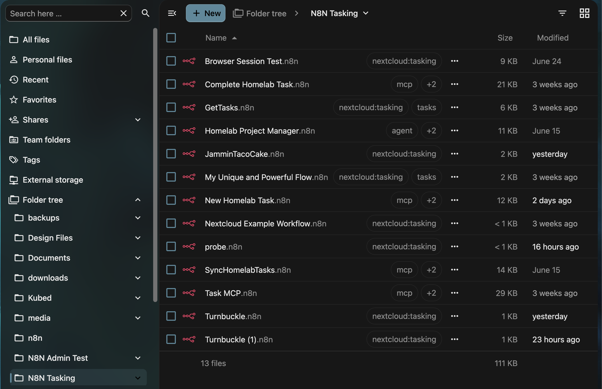
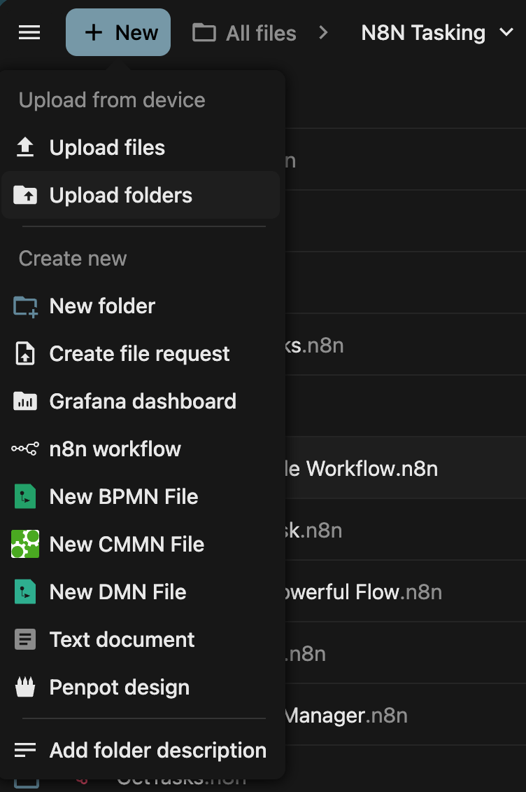
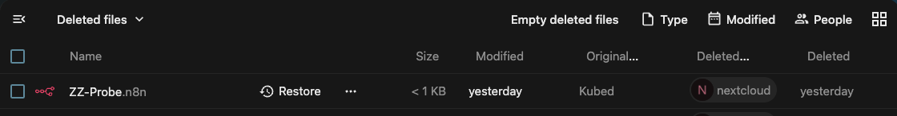
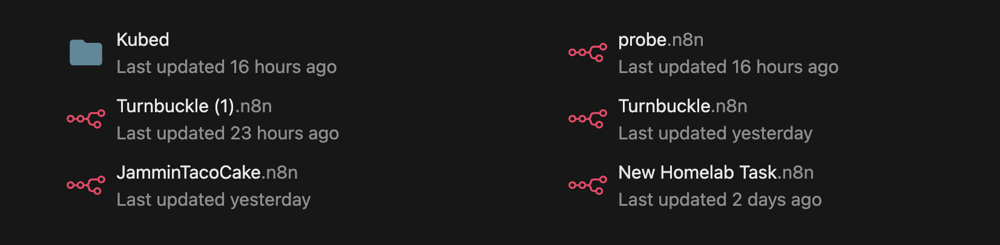
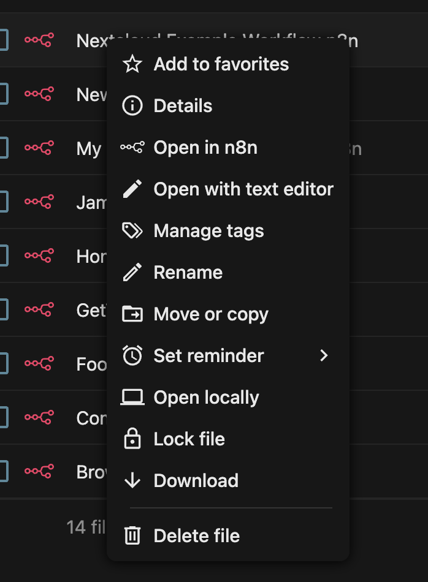
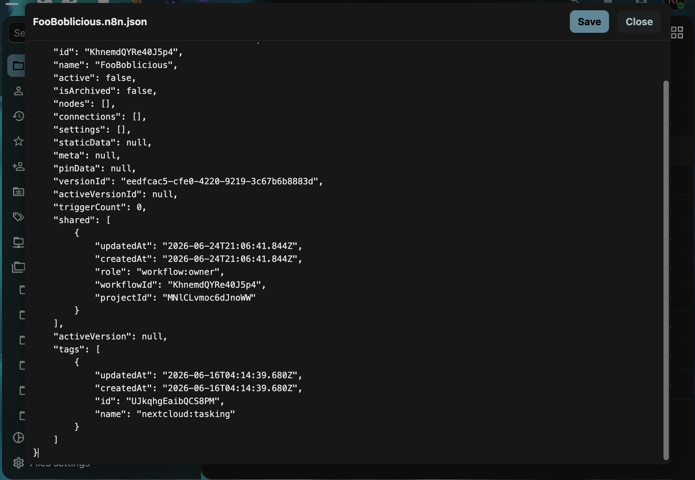
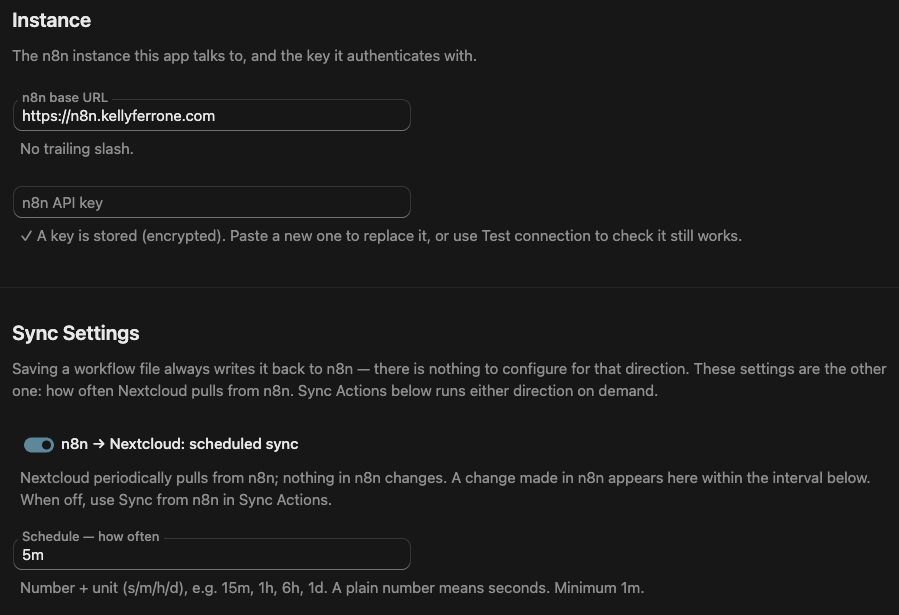
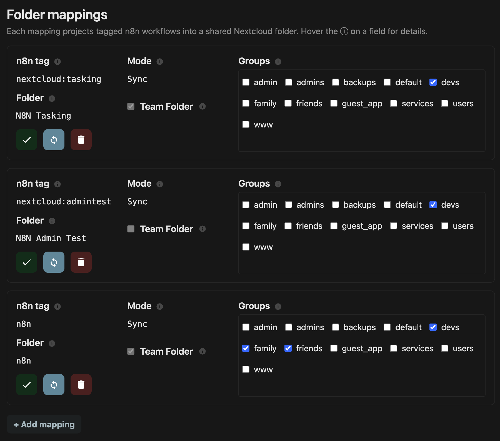
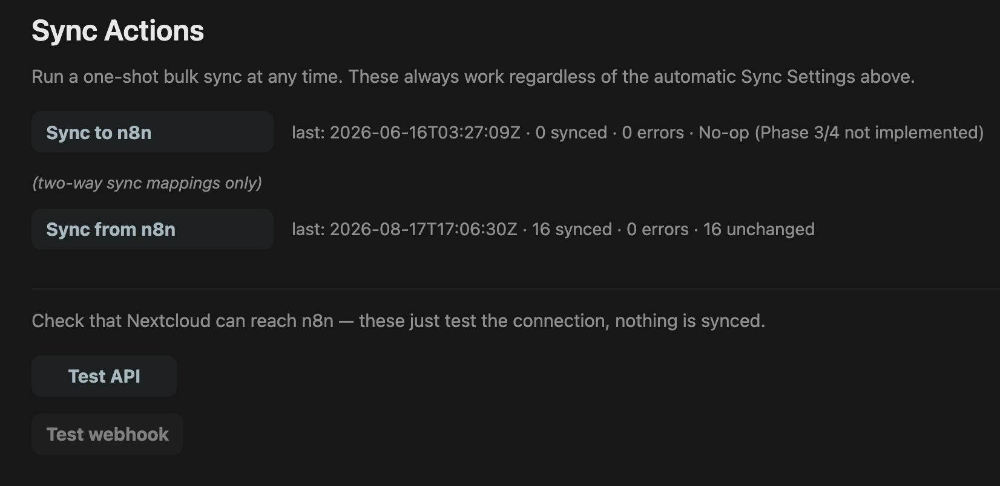

# n8n Sync

**Your n8n workflows, living in Nextcloud as real files.** Browse them, edit them, tag them, trash them, restore them — and every one of those gestures lands in n8n for real. 🎉

[](https://github.com/kubed-io/nextcloud-n8n/actions/workflows/tests.yml)
[](https://github.com/kubed-io/nextcloud-n8n/actions/workflows/quality.yml)
[](https://github.com/kubed-io/nextcloud-n8n/actions/workflows/integration.yml)
[](LICENSE)
[](https://apps.nextcloud.com)
[](composer.json)



*That's a Nextcloud folder. Those are n8n workflows. Real files, real icons, real tags, real dates.*

---

## The whole idea, in one breath

Point the app at your n8n instance, bind an n8n **tag** to a Nextcloud **folder**, and every workflow wearing that tag shows up in that folder as a `.n8n` file.

```
n8n (tagged workflows)  ⟺  Nextcloud (mapped folder)
```

Edit one in the Files app and n8n has it seconds later. Rename it in n8n and the file renames itself. And since Nextcloud is holding the complete workflow JSON, your mapped folder is quietly also the easiest backup you'll never have to think about. 💾

Nothing is matched on filename. Every file carries its workflow's **id**, so renaming, moving, copying, trashing and restoring never break the link — and re-running a sync never duplicates a thing. Ever. 🙅

---

## ✨ Create, read, update, delete — from either side

That's the pitch. Do it in n8n, do it in Nextcloud, it doesn't matter:

| You do this… | …and this happens |
|---|---|
| Make a `.n8n` file in a mapped folder | A real workflow appears in n8n, tagged and live |
| Tag a workflow in n8n | A file appears in the mapped folder |
| Save an edit in Nextcloud | The workflow is updated in n8n |
| Edit the workflow in n8n | The file's JSON is rewritten to match |
| Rename either one | The filename, the JSON `name`, and n8n all agree |

Author a workflow in your editor of choice, over WebDAV, or from the desktop client — it goes live in n8n without you ever opening the n8n UI. Make a file *outside* a mapped folder and it stays a plain, untracked document, no strings attached.

📋 [`create.feature`](features/workflows/create.feature) · ✍️ [`edit.feature`](features/workflows/edit.feature) · 🔤 [`rename.feature`](features/workflows/rename.feature)



*Nextcloud's **+ New** menu learns a new trick. Click "n8n workflow", name it, done — it's live in n8n before the dialog closes.*

---

## 🚚 Move it, copy it, duplicate it

A **move** is always *the same workflow* going somewhere. A **copy** is always *a new one*. Simple rule, and the app is fanatical about it.

- **Move within your mapping** — a rename or a subfolder shuffle. n8n doesn't even blink.
- **Move it out** — the file goes **unmapped**: Nextcloud keeps the full JSON *and* the workflow's identity, n8n archives the workflow. Nothing is lost; you're just holding the only live copy. 📦
- **Move it back in** — the *same* workflow is unarchived in n8n. Not a fresh one. The same one.
- **Move it to a different mapped folder** — it rebinds to its new home and re-tags itself in n8n.
- **Copy it** — always a brand-new workflow with its own id and its own name. Duplicating a workflow is now "Ctrl+C, Ctrl+V". 🍝

A copy never inherits the original's identity — the metadata is stripped the instant it's copied — so a stray duplicate can't hijack the workflow it came from. And links refuse to be moved or copied at all, because a pointer that wanders is just a bug with extra steps.

🚚 [`move.feature`](features/workflows/move.feature) · 🍝 [`copy.feature`](features/workflows/copy.feature)

---

## 🗑️ Delete, restore, purge

Nextcloud's trash is reversible, so trashing a workflow is too. Nothing is destroyed until you say you mean it.

Trash a **sync** file and here's what n8n does:

| Gesture | What n8n does |
|---|---|
| 🗑️ Move to trash | Workflow is **archived** — hidden, preserved |
| ↩️ Restore from trash | Workflow is **unarchived**, right back where it was |
| 💥 Empty the trash | Workflow is **permanently deleted** |

It works from the n8n side too: archive a workflow there and its file lands in the Nextcloud trash; unarchive it and the file comes back out. Delete it for good in n8n and the trashed file is cleared. Personal trash, Team Folder trash — both. 🎯

The safety rails you'd hope for are all here: an **unmapped** file is just a file, so purging one leaves n8n completely alone. Deleting a **link** is refused outright — removing one pointer shouldn't un-map a workflow for the whole team. And if n8n is unreachable when you hit delete, the delete aborts rather than letting the two systems drift apart.

🗑️ [`delete.feature`](features/workflows/delete.feature) · ↩️ [`restore.feature`](features/workflows/restore.feature) · 💥 [`purge.feature`](features/workflows/purge.feature)



*A trashed workflow is archived in n8n, not gone. Hit **Restore** and it's live again on both sides.*

---

## 🏷️ Tags — one set, three surfaces, every direction

This is the part we're smug about. 😏

A workflow's tags are part of the workflow, so they're part of the mirror. n8n keeps tags on the workflow; Nextcloud has its own first-class **system tags** — those searchable coloured pills in Files. n8n Sync keeps the two sets identical, which means **your mirror is as searchable as n8n itself**. Want every `prod` workflow? Filter for it the Nextcloud-native way. 🔍

There are **three** places to change a **sync** workflow's tags, and all three agree with each other:

| Change them… | …and |
|---|---|
| 🏷️ On the file's pills in Files | It pushes to n8n on its own — no "Sync to n8n" click needed |
| 📝 In the `tags` array inside the `.n8n` | Saving pushes to n8n and updates the pills |
| 🔧 In n8n | The next sync brings them to both the file and its pills |

(A **link** is read-only, and an **unmapped** file has no n8n side left to push to — both keep their pills and `tags` array in step locally. More on that below. 👇)

Adding, removing, or doing both at once is **one gesture** wherever you do it. You can even add a tag by name alone — write `{"name": "prod"}`, save, and n8n mints the real id for you. Nothing rewrites the file out from under you while you're typing in it.

Tags survive travel, too. Pills belong to a file id and are lost on a copy, but the `tags` array is *in* the file — so tag an untracked `.n8n`, drop it into a mapped folder later, and the workflow n8n creates for it arrives **already wearing those tags**. ✈️

Two more things worth knowing:

- **The mapping tag *is* the membership.** Remove the tag that binds a workflow to its folder — from either side — and the workflow leaves the mapping. The file goes, the workflow stays safe in n8n with its other tags intact. Nothing deleted, nothing archived.
- **A link is a read-only projection.** Its tags flow one way (n8n → Nextcloud) purely to keep the pointer searchable. Click a pill on a link and it'll politely settle back on the next pull — re-tag linked workflows in n8n.

🏷️ [`tags.feature`](features/workflows/tags.feature)

---

## 🎨 A first-class file type — icon, mimetype, honest timestamps

A managed workflow isn't a generic JSON blob. The app registers the `application/n8n+json` mimetype, so your workflows wear the **real n8n icon** instead of a sad little document glyph.

Then there's the detail we're quietly proud of: **a mirror gets the timestamps of the thing it mirrors.** n8n's `updatedAt` becomes the file's modification time and `createdAt` its creation time — because "the sync job wrote this file at 15:02" is never the question someone sorting a folder by date is actually asking. A workflow nobody has touched in a year should *look* like it. 🕰️

The payoff is that Nextcloud's own features just work on your automation, for free:



*Nextcloud's **Popular files** widget, showing n8n workflows with n8n's icon and n8n's real timestamps. We didn't build this view — it just works, because the metadata is honest.*

And every file's state is queryable over WebDAV. A raw `PROPFIND` hands back the workflow's identity in the XML:

| DAV property | What it holds |
|---|---|
| `nc:metadata-n8n_id` | The workflow's id in n8n |
| `nc:metadata-n8n_mode` | `sync`, `reference`¹, or `unmapped` — and it's **indexed** |
| `nc:metadata-n8n_versionId` | Version id of the last successful sync |
| `nc:metadata-n8n_mapping` | The mapping this file belongs to |

These are **read-only** — clients can't touch them with `PROPPATCH`; the sync engine owns them. Because `n8n_mode` is indexed, "find every sync workflow" is a fast DAV query rather than a folder walk.

¹ `reference` is the on-the-wire value for **link** mode — Nextcloud's PROPFIND treats a stored `link` as a callback and falls over. Everywhere a human looks, it's **link**.

👀 [`view.feature`](features/workflows/view.feature)

---

## 🖱️ Open in n8n, or pop the hood

Two openers, and the file's mode picks the default:

- **Open in n8n** — jumps straight to the live editor. Offered for **sync** and **link** files, and it's their default click.
- **Open with text editor** — the raw JSON, always available. For an **unmapped** file there's no live workflow to jump to, so this becomes the default.

🖱️ [`open-with.feature`](features/workflows/open-with.feature)

<table>
<tr>
<td width="45%"></td>
<td width="55%"></td>
</tr>
<tr>
<td><em>Right-click: straight to n8n, or straight to the JSON.</em></td>
<td><em>Hit <strong>Save</strong> and n8n has it. That's the whole workflow — including its <code>tags</code>.</em></td>
</tr>
</table>

---

## 🧭 Sync or Link — the folder decides

Every mapping is one of two modes, and it applies to every workflow the mapping pulls. One knob, no per-file overrides to reason about.

| Mode | The file holds | Pushes back? |
|---|---|---|
| 🔁 **Sync** | The full workflow JSON | **Yes** — fully bidirectional |
| 🔗 **Link** | A tiny pointer (id, name, URL) | No — clicking it opens n8n |

There's a third state you don't configure: **unmapped**. That's what a sync file *becomes* when you move it out of its folder — full JSON, keeps its identity, archived in n8n, restorable by moving it back. A portable archive of a workflow. 📦

---

## 🛠 Setup, in three moves

**1. Point it at n8n.** Base URL and an API key, stored encrypted and never echoed back. That is the whole connection.



**2. Map a tag to a folder.** Pick the n8n tag, the mode, and which groups get to see it. Backed by a Team Folder or an admin-owned shared folder, your call.



**3. Sync it.** Scheduled pulls on whatever interval you like, plus one-shot buttons whenever you're impatient — and "Test connection" so you're never guessing whether it works.



🔌 [`connection.feature`](features/connection/connection.feature) · 🗂️ [`mapping/create.feature`](features/mapping/create.feature) · 🔄 [`sync-now.feature`](features/connection/sync-now.feature)

---

## ⌨️ Every button is also a command

The whole setup is scriptable, so a Kubernetes init job can stand the thing up with no clicking. Exit `0` on success, non-zero on failure.

```sh
# Connect
occ config:app:set n8n_sync n8n_url --value="https://n8n.example.com"
echo "$N8N_API_KEY" | occ n8n_sync:set-api-key      # stdin keeps it out of your history
occ n8n_sync:test-connection

# Map a tag to a folder
occ n8n_sync:add-mapping '{"n8n_tag":"nextcloud:alpha","team_folder":"alpha","nc_groups":["devs"],"mode":"sync","use_team_folder":true}'
occ n8n_sync:list-mappings
occ n8n_sync:set-groups <mapping-id> devs,admins
occ n8n_sync:remove-mapping <mapping-id>

# Sync — one mapping, or all of them
occ n8n_sync:sync pull --mapping=nextcloud:alpha
occ n8n_sync:sync push --mapping=nextcloud:alpha
occ n8n_sync:sync pull

# Poke n8n directly
occ n8n_sync:list-workflows --limit=10 --tag=my-tag
occ n8n_sync:get-workflow <workflow-id>
```

---

## 📋 The specs are the docs

Every feature above links to an **executable specification** — a Gherkin `.feature` file under [`features/`](features/) written in plain language, which also *drives the integration tests*. They're written before the code and kept true after it. If a `.feature` file says it, CI proves it. 🧪

Read [`features/README.md`](features/README.md) for how they're organised.

---

## 📜 Licence & trademark

AGPL-3.0-or-later. See [LICENSE](LICENSE).

This is a community integration and is not affiliated with, endorsed by, or sponsored by n8n GmbH. "n8n" and the n8n logo are trademarks of n8n GmbH, used here only to identify the service this app integrates with.
